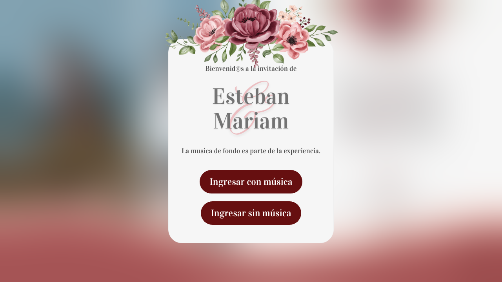

<h1 align="center">💍 Digital Wedding Invitation</h1>

<p align="center">Instead of a standard paper invite, we designed our own interactive digital wedding invitation — countdown, photo gallery, parallax scenes, music, and an online RSVP.</p>

<p align="center">
  <a href="https://invitacion-boda-silk.vercel.app/"></a>
</p>

<p align="center">
  
</p>

<p align="center">
  
  
  
</p>

## About

A personal, hand-built wedding invitation site for Esteban & Mariam:

- ⏳ **Live countdown** to the big day
- 🖼️ **Photo gallery** with a responsive masonry layout and lightbox
- 🌄 **Parallax scrolling** scenes for a storytelling feel
- 🎵 **Background music** with a play/pause toggle
- 📝 **Online RSVP form** that writes guest responses straight to a Google Sheet via SheetDB

## Tech

React · Sass · `react-photo-album` + `react-grid-gallery` · `react-scroll-parallax` · `react-countdown` · `use-sound` · SheetDB (Google Sheets backend)

## Run locally

```bash
npm install
npm start        # http://localhost:3000
npm run build    # production build
```

---

<p align="center"><i>by Esteban Acuña · <a href="https://estebanacuna.dev">estebanacuna.dev</a></i></p>
